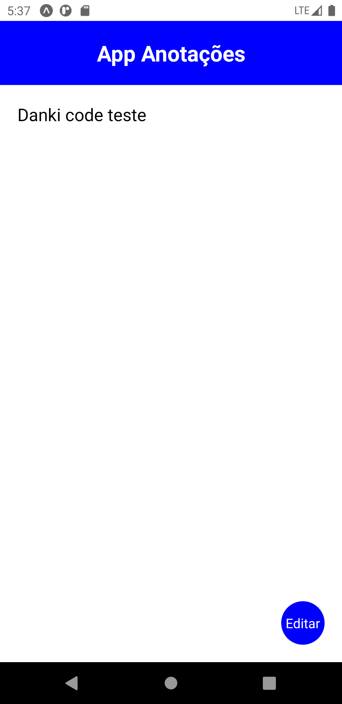
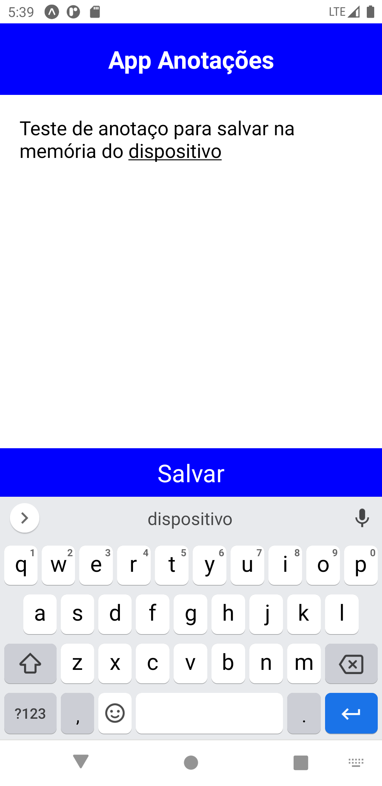

<h1 align="center">
    
    
</h1>

## 🐱‍💻 Sobre

Esta é uma aplicação simples desenvolvida a partir do **Curso de Desenvolvimento de Apps** da Danki Code. O app é um aplicativo de anotação simples que permite a leitura e escrita de anotações. Toda anotação é salva na **memória do dispositivo (storage)**, permitindo que o app seja fechado e aberto, posteriormente, sem que haja perda de informação.

---

## ✔ Tecnologias utilizadas

- React Native
- Expo
- Javascript
- NodeJS
- Yarn

---

## ✈ Como baixar o projeto

```bash

    # Clonar o repositório
    $ git clone https://github.com/souza-anderson/nlw-ecoleta

    # Entrar no diretório do projeto
    $ cd app-notes

    # Instalar as dependências
    $ yarn

    # Executar o projeto
    $ yarn start

```
---
## :page_facing_up: Licença
Desenvolvido por Anderson Souza e sob a licença [MIT](/LICENSE).
